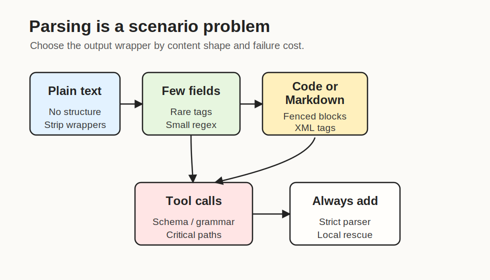
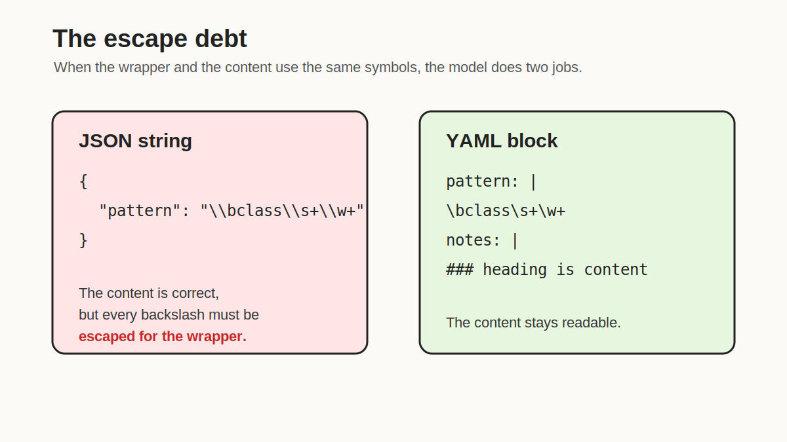
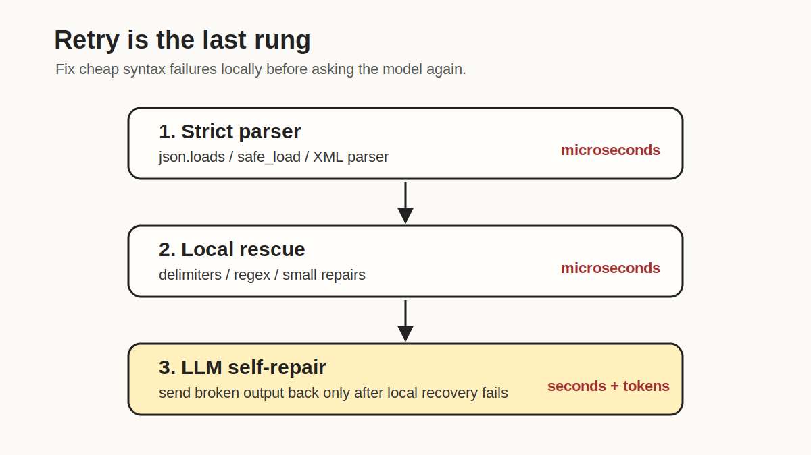

The output of an LLM rarely stays as plain text once it leaves the model. In most production systems, it is parsed, validated, and converted into application state: labels, search queries, tool arguments, code patches, retrieved spans, or memory updates. I will call this intermediate step the *parse boundary*: the place where stochastic generation meets deterministic program execution. The reliability of an LLM application depends, to a much larger extent than is usually acknowledged, on what happens at this boundary.

In a single-turn chat application, malformed output is mostly a UX problem. In agent systems (Weng 2023; Yao et al. 2023; Schick et al. 2023), the parse boundary is crossed many times per task, and each crossing converts text into the next state of the program. A bad parse can call the wrong tool, pass the wrong argument, drop a critical observation, or, worse, silently extract the wrong field and continue with confidence.

This post reviews the design space of output parsing for LLM applications: where things break, what formats to choose, how constrained decoding fits in, and what a reasonable recovery procedure looks like.

The summary up front: most parsing failures are not really about JSON syntax. They are about a mismatch between the content being generated, the wrapper used to carry it, and the failure cost of the action it triggers.



## The Parse Boundary

A textbook view of an LLM application is

\[
x \longrightarrow f_\theta \longrightarrow y
\]

where \(x\) is the prompt, \(f_\theta\) is the model, and \(y\) is text. The view that matters in practice is

\[
x \longrightarrow f_\theta \longrightarrow y \xrightarrow{\text{parse}} s \xrightarrow{\text{validate}} s^\star \xrightarrow{\text{act}} \text{side effect}
\]

where \(s\) is some structured representation extracted from \(y\), \(s^\star\) is the validated version of \(s\), and the side effect can be a tool call, a database write, a UI update, or a memory update inside an agent loop. Each arrow is a place where errors can be introduced, masked, or amplified.

ReAct (Yao et al. 2023) is a useful concrete example because it makes the parse boundary explicit by design. The model alternates between *Thought*, *Action*, *Action Input*, and *Observation*, and the runtime distinguishes these by parsing the model's text. Toolformer (Schick et al. 2023) and modern provider-native function calling move part of this responsibility into model or inference-stack design, but the boundary itself does not disappear. It just moves.

A useful way to organize failures at this boundary is by which layer they break.

| Layer | Failure | Detection |
| --- | --- | --- |
| Syntax | Output cannot be parsed at all | Parser raises |
| Schema | Parses, wrong shape | Schema validator |
| Semantics | Valid shape, wrong values | Task-level checks, evaluation |
| Policy | Plausible but unsafe action | Application policy, sandbox |

A common engineering anti-pattern is to ask one layer to do another layer's job: a regex tries to enforce semantics, a schema validator is expected to catch unsafe actions, or a permission check is replaced by a more carefully worded prompt. Each of these is a load-bearing assumption that tends to fail under distribution shift.

## Why JSON Is Both Useful and Fragile

JSON is a reasonable default when the content is short, shallow, and naturally record-shaped, for example a classification with a confidence:

```json
{"label": "refund_request", "confidence": 0.82}
```

It becomes fragile when the *content* inside the JSON is itself code-like. Consider asking the model to return a regular expression:

```text
{"pattern": "\bclass\s+\w+"}
```

The intent is clear, but the string is invalid JSON. The correct output is:

```json
{"pattern": "\\bclass\\s+\\w+"}
```

The interesting payload was correct. The wrapper was not. The same issue surfaces with Python, LaTeX, Markdown, SQL, shell commands, Windows paths, and JSON-inside-JSON. Each of these formats already uses quotes, braces, brackets, backslashes, indentation, or delimiters as syntax. When the outer wrapper reuses the same characters, the model has to do two jobs: generate the answer and escape it for the wrapper. Empirically, the second job is often what fails first on weaker models.



This is consistent with several recent findings. Tam et al. (2024) report that imposing strict format constraints can degrade task performance, especially for smaller models and delimiter-heavy outputs. Strobl et al. (2024) survey the formal-language capabilities of transformers; while the picture is nuanced, balanced bracket languages are a non-trivial constraint to enforce purely through next-token prediction.

Zhang et al. (2025) make a related point in *Why Prompt Design Matters and Works*. For answer-only Transformer models, each generated token is computed through a fixed-depth stack of attention and feedforward layers. Counting and sorting require step-wise state updates, but answer-only decoding hides those steps inside bounded-depth computation. Their experiments also show that counting is sensitive to tokenization: when the reasoning unit does not align cleanly with tokens, accuracy can degrade sharply. This is why the joke "LLMs are bad at counting braces" points at a real issue. Valid nested JSON asks the model to keep track of open braces, quotes, commas, and escapes all at once.

The practical implication is not "avoid JSON." The implication is that JSON should be chosen because the payload is record-shaped and the model is comfortable producing it, not because structured output feels professional. Nested JSON containing escaped code strings is the worst case: the model is asked to count braces and escape characters at the same time.

## A Taxonomy of Output Formats

We can organize output formats by the shape of the payload they are best suited for. The general principle is to use the smallest wrapper that can represent the result without forcing the model to escape its own content.

**Plain text.** When the consumer is a human reader, the wrapper should usually be nothing at all. A surprising fraction of "LLM parsing bugs" disappear once the application stops trying to extract structure from a response that did not need any.

**Tiny records with rare delimiters.** For one or two atomic fields, rare delimiters are simple, robust, and orthogonal to the content. A pattern that has worked well in practice:

```text
Return the final label between the exact markers below.
Do not use these markers anywhere else.

<<<LABEL_7A91>>>
LABEL_VALUE
<<<END_LABEL_7A91>>>
```

The parser is one regex. The random suffix avoids accidental collision with markers in the user's document. Generic tags such as `<answer>` should be avoided in extraction tasks where the input may itself contain similar tags.

**Multi-line content with block formats.** For code, Markdown, LaTeX, logs, or long natural-language fields, block formats avoid heavy escaping. YAML block literals preserve content essentially verbatim:

```yaml
summary: |
  The model can write normal text here.
  "Quotes" do not need escaping.
  Backslashes like \bclass\s+\w+ remain readable.
```

XML-style tags are useful when each section has an obvious boundary and when streaming consumption is needed:

```xml
<analysis>
The model can write freely here.
</analysis>
<patch>
def hello():
    print("hello")
</patch>
```

The choice between YAML and XML is less important than the principle that the wrapper should not fight the payload.

**Tool calls and external actions.** When the output triggers an external side effect, the design space changes. The parse boundary is no longer just an extraction step; it is also an authorization step. Provider-native function calling, JSON Schema validation, and grammar-constrained decoding all reduce syntactic failures, but they do not address policy. A syntactically perfect tool call can still be the wrong tool call.

## Constrained Decoding

A complementary approach to prompt-level format instructions is to constrain the decoder itself, so that the only tokens it can emit at each step are those consistent with a target grammar or schema. Let \(\mathcal{V}\) be the model vocabulary, \(C\) a constraint such as a context-free grammar, a regular expression, or a JSON Schema, and \(\mathcal{V}_t(C, y_{\lt t}) \subseteq \mathcal{V}\) the set of tokens that keep the prefix \(y_{\lt t}\) extendable to some string in \(C\). In a simplified form, constrained decoding samples:

\[
y_t \sim \frac{p_\theta(y_t \mid x, y_{\lt t}) \cdot \mathbb{1}[y_t \in \mathcal{V}_t(C, y_{\lt t})]}{Z_t}
\]

where \(Z_t\) is the renormalizing constant over the allowed token set. Several systems implement variants of this idea: grammar-constrained decoding (Geng et al. 2023), guided generation via finite-state machines as in Outlines (Willard and Louf 2023), high-throughput grammar engines such as XGrammar (Dong et al. 2024), and language-model programming abstractions like LMQL (Beurer-Kellner et al. 2023).

Two caveats are worth highlighting. First, constraining the support set does not change the model's preferences; it only zeros out invalid tokens. If the model would have preferred a string outside the grammar, the constrained sample can follow a low-probability path that satisfies syntax but degrades semantics. This is one mechanism behind the format tax effect studied by Tam et al. (2024) and benchmarked more systematically for structured outputs by Geng et al. (2025).

Second, constrained decoding only enforces syntax or schema-like constraints. Value plausibility and policy compliance still have to be checked downstream.

In practice, constrained decoding pairs well with narrow schemas and short payloads: a tool name from a closed set, an enum label, or a small JSON object with three fields. It pairs poorly with long free-form fields embedded inside a strict wrapper, where the constraint amplifies the cost of every escape.

## Response Schema Design

When a schema is needed, it should be designed as a *response schema*, not as a mirror of the application's internal domain model. The response schema is a contract between the model and the parser; the internal model is a contract between the parser and the rest of the system. Conflating the two tends to produce schemas that are easy for the application to consume and hard for the model to satisfy.

A few design rules consistently reduce parse failures and silent misparses:

1. Prefer enums over open-ended strings when the value set is known. An enum is also a friendly target for constrained decoding.
2. Prefer discriminated unions over many optional fields. A schema with twelve optional fields validates almost any object; a discriminated union forces the model to commit.
3. Keep nesting shallow. Each additional level of nesting is bookkeeping debt for the model and another opportunity for delimiter mismatch.
4. Represent uncertainty explicitly with `null`, an `"unknown"` enum value, or an empty list, rather than relying on omission.
5. Carry provenance when extraction quality matters: a `source_span`, `evidence`, or `raw_text` field makes silent misparses detectable in evaluation.
6. Separate the *scratch space* used for free-form reasoning from the *action payload* that will actually be executed. The reasoning channel can be expressive; the action payload should be dull, short, and easy to validate.

The last point connects to a broader observation about agents. ReAct (Yao et al. 2023) interleaves reasoning and acting in a single token stream, and Reflexion (Shinn et al. 2023) extends this with self-critique. Both designs benefit from a clean separation between the parts of the output that are reasoning, and therefore allowed to be loose, and the parts that are commitments to the environment, which must be tight.

## A Recovery Procedure

No format choice eliminates failures, so any production system needs a recovery procedure. A simple three-stage pipeline covers most cases observed in practice.



The first stage is a strict parser for the expected format, such as `json.loads`, `yaml.safe_load`, or `xml.etree.ElementTree.fromstring`, followed by schema validation. Successful outputs proceed; the exception message is retained for the next stage.

The second stage attempts deterministic local recovery before incurring another model call:

```python
import re

YAML_BLOCK = re.compile(r"```ya?ml\s*(.*?)```", re.S | re.I)

def extract_yaml_block(text: str) -> str:
    match = YAML_BLOCK.search(text)
    return match.group(1).strip() if match else text.strip()
```

Typical local repairs include extracting content between rare delimiters, locating fenced code blocks, trimming conversational prefixes and suffixes, removing a single trailing comma, and closing a shallow missing bracket when the repair is unambiguous. Local recovery should be conservative: if more than one repair is plausible, it is safer to fail than to silently extract the wrong object.

The third stage is LLM self-repair, used only when the first two fail. The repair prompt should be narrow: the model is being asked to preserve meaning while fixing syntax, not to redo the original task. Reopening the full task in the repair step is a common cause of semantic drift, where a syntactically valid output ends up with a different label than the original attempt. Even with a narrow prompt, self-repair adds latency, consumes tokens, and reintroduces stochasticity into what should be a deterministic step. In an agent loop, the cost compounds across iterations; for high-volume applications, it is usually cheaper to invest in tier-one and tier-two reliability than to rely on tier three.

Logging the raw output at each stage is non-negotiable. A parse that succeeded for the wrong reason is invisible without it.

## Implications for Agent Systems

In agent systems, the parse boundary is crossed once per step:

\[
\text{plan} \to \text{parse} \to \text{tool call} \to \text{parse observation} \to \text{update memory} \to \text{plan}
\]

Each arrow is a conversion between text and program state. A small parse error rate \(\epsilon\) per step compounds into a much larger trajectory error rate over \(T\) steps. For independent failures, the probability of at least one bad parse is approximately \(1 - (1 - \epsilon)^T\). This is why "just ask the model to output JSON" is structurally insufficient as an engineering strategy: agent reliability is a property of the entire chain of parse boundaries, not of any single one.

Two design choices help in practice. The first is to keep tool interfaces narrow. A broad tool that accepts a complex payload is harder to validate, harder to constrain, and harder to log meaningfully; an agent that fails on a broad tool fails in many ways. The second is to make scratch space and action payload structurally distinct, so that models can be loose where looseness is harmless and tight where it matters.

## Discussion

A reasonable engineering posture toward output parsing is the following. Use the format that minimizes the work the model has to do at the wrapper level for the content type at hand. Apply constrained decoding when the schema is narrow and syntactic validity is load-bearing. Validate aggressively, and validate at the right layer: syntax with a parser, shape with a schema, values with task-level checks, actions with policy. Recover locally before retrying. Log raw outputs. Treat the parse boundary as a designed interface, not as an afterthought.

This is not a complete recipe; it is a framing. The empirical question of which formats work best for which models is still open, and the answer continues to shift as models improve at instruction following and as inference stacks add native support for structured generation. What is unlikely to shift is the underlying observation: in any system where text from a model becomes input to another program, the boundary between the two is where reliability is decided.

## References

[1] Weng, Lilian. [*LLM Powered Autonomous Agents*](https://lilianweng.github.io/posts/2023-06-23-agent/). Lil'Log, 2023.

[2] Yao, Shunyu, et al. [*ReAct: Synergizing Reasoning and Acting in Language Models*](https://arxiv.org/abs/2210.03629). ICLR 2023.

[3] Schick, Timo, et al. [*Toolformer: Language Models Can Teach Themselves to Use Tools*](https://arxiv.org/abs/2302.04761). NeurIPS 2023.

[4] Shinn, Noah, et al. [*Reflexion: Language Agents with Verbal Reinforcement Learning*](https://arxiv.org/abs/2303.11366). NeurIPS 2023.

[5] Tam, Zhi Rui, et al. [*Let Me Speak Freely? A Study on the Impact of Format Restrictions on Performance of Large Language Models*](https://arxiv.org/abs/2408.02442). arXiv:2408.02442, 2024.

[6] Geng, Saibo, et al. [*Grammar-Constrained Decoding for Structured NLP Tasks without Finetuning*](https://arxiv.org/abs/2305.13971). EMNLP 2023.

[7] Willard, Brandon T., and Remi Louf. [*Efficient Guided Generation for Large Language Models*](https://arxiv.org/abs/2307.09702). arXiv:2307.09702, 2023.

[8] Dong, Yixin, et al. [*XGrammar: Flexible and Efficient Structured Generation Engine for Large Language Models*](https://arxiv.org/abs/2411.15100). MLSys 2025.

[9] Geng, Saibo, et al. [*Generating Structured Outputs from Language Models: Benchmark and Studies*](https://arxiv.org/abs/2501.10868). arXiv:2501.10868, 2025.

[10] Strobl, Lena, et al. [*What Formal Languages Can Transformers Express? A Survey*](https://direct.mit.edu/tacl/article/doi/10.1162/tacl_a_00663/120983/What-Formal-Languages-Can-Transformers-Express-A). TACL 2024.

[11] Zhang, Xiang, et al. [*Why Prompt Design Matters and Works: A Complexity Analysis of Prompt Search Space in LLMs*](https://aclanthology.org/2025.acl-long.1562/). ACL 2025.

[12] Beurer-Kellner, Luca, Marc Fischer, and Martin Vechev. [*Prompting Is Programming: A Query Language for Large Language Models (LMQL)*](https://arxiv.org/abs/2212.06094). PLDI 2023.
